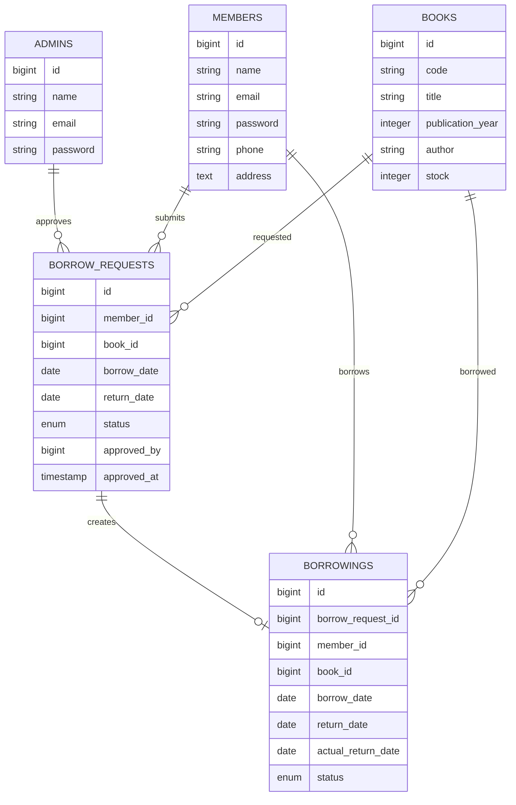

# PRD Aplikasi Web Peminjaman Buku

## 1. Ringkasan Produk

Aplikasi ini adalah sistem web sederhana untuk mengelola peminjaman buku di perpustakaan. Sistem memiliki dua jenis pengguna, yaitu **Admin** dan **Anggota**.

Admin dapat mengelola data buku, mengelola data anggota, melihat pengajuan peminjaman buku, menyetujui atau menolak pengajuan, serta memperbarui status pengembalian buku. Anggota dapat mengajukan peminjaman buku dan melihat daftar buku yang sedang atau pernah dipinjam.

## 2. Tujuan Produk

Tujuan aplikasi ini adalah:

1. Mempermudah admin dalam mengelola data buku.
2. Mempermudah admin dalam mengelola data anggota.
3. Mempermudah anggota dalam mengajukan peminjaman buku.
4. Mengelola stok buku secara otomatis saat pengajuan disetujui dan saat buku dikembalikan.
5. Menyediakan API sederhana untuk pengelolaan data buku dengan response JSON.
6. Menampilkan data secara interaktif menggunakan DataTables serverside.

## 3. Jenis Pengguna

### 3.1 Admin

Admin adalah pengguna yang memiliki akses untuk mengelola sistem.

Fitur admin:

- Login sebagai admin.
- CRUD master buku.
- CRUD anggota.
- Melihat daftar pengajuan peminjaman buku.
- Melakukan approve atau reject pengajuan peminjaman buku.
- Melihat daftar peminjaman buku yang sudah disetujui.
- Mengubah status peminjaman ketika buku sudah dikembalikan oleh anggota.
- Stok buku otomatis berkurang ketika pengajuan disetujui.
- Stok buku otomatis bertambah ketika buku dikembalikan.

### 3.2 Anggota

Anggota adalah pengguna yang dapat melakukan pengajuan peminjaman buku.

Fitur anggota:

- Login sebagai anggota.
- Mengajukan peminjaman buku.
- Memilih buku yang ingin dipinjam.
- Mengisi tanggal peminjaman.
- Mengisi tanggal pengembalian.
- Melihat daftar peminjaman buku miliknya sendiri.

## 4. Ruang Lingkup Fitur

### 4.1 Autentikasi Multiuser

Sistem menggunakan fitur multiauth Laravel berbasis Guard.

Guard yang digunakan:

- `admin`
- `member`

Aturan:

- Admin hanya dapat mengakses halaman admin.
- Anggota hanya dapat mengakses halaman anggota.
- Pengguna yang belum login akan diarahkan ke halaman login sesuai guard masing-masing.

### 4.2 CRUD Master Buku

Admin dapat menambah, melihat, mengubah, dan menghapus data buku.

Atribut buku:

- Kode buku
- Judul buku
- Tahun terbit
- Penulis
- Stok buku

Validasi:

- Kode buku wajib diisi dan harus unik.
- Judul buku wajib diisi.
- Tahun terbit wajib diisi dan berupa angka.
- Penulis wajib diisi.
- Stok buku wajib diisi, berupa angka, dan tidak boleh bernilai negatif.

### 4.3 CRUD Anggota

Admin dapat menambah, melihat, mengubah, dan menghapus data anggota.

Atribut anggota:

- Nama
- Email
- Password
- Nomor telepon
- Alamat

Validasi:

- Nama wajib diisi.
- Email wajib diisi dan harus unik.
- Password wajib diisi saat membuat anggota baru.
- Password disimpan dalam bentuk hash.

### 4.4 Pengajuan Peminjaman Buku

Anggota dapat membuat pengajuan peminjaman buku.

Data pengajuan:

- Anggota
- Buku
- Tanggal peminjaman
- Tanggal pengembalian
- Status pengajuan

Status pengajuan:

- `pending`
- `approved`
- `rejected`

Aturan:

- Anggota hanya dapat memilih buku dengan stok lebih dari 0.
- Saat pengajuan dibuat, status default adalah `pending`.
- Admin dapat menyetujui atau menolak pengajuan.
- Jika pengajuan disetujui, stok buku otomatis berkurang 1.
- Jika pengajuan ditolak, stok buku tidak berubah.

### 4.5 Peminjaman Buku

Peminjaman buku adalah data pengajuan yang sudah disetujui oleh admin.

Status peminjaman:

- `borrowed`
- `returned`

Aturan:

- Saat pengajuan disetujui, sistem membuat data peminjaman.
- Admin dapat mengubah status peminjaman menjadi `returned`.
- Saat status berubah menjadi `returned`, stok buku otomatis bertambah 1.
- Anggota hanya dapat melihat daftar peminjaman miliknya sendiri.

### 4.6 DataTables Serverside

List data pada aplikasi ditampilkan menggunakan DataTables serverside, misalnya menggunakan package Yajra DataTables.

Data yang ditampilkan menggunakan DataTables:

- List buku
- List anggota
- List pengajuan peminjaman
- List peminjaman buku

### 4.7 jQuery AJAX

Aplikasi mengimplementasikan jQuery AJAX minimal pada beberapa proses.

Contoh proses yang menggunakan AJAX:

- Submit form tambah atau edit buku.
- Hapus data buku.
- Approve atau reject pengajuan peminjaman.
- Ubah status peminjaman menjadi dikembalikan.

## 5. Rancangan Database

### 5.1 Tabel `admins`

| Field | Tipe Data | Keterangan |
| --- | --- | --- |
| id | bigint | Primary key |
| name | varchar | Nama admin |
| email | varchar | Email admin, unique |
| password | varchar | Password terenkripsi |
| created_at | timestamp | Waktu data dibuat |
| updated_at | timestamp | Waktu data diperbarui |

### 5.2 Tabel `members`

| Field | Tipe Data | Keterangan |
| --- | --- | --- |
| id | bigint | Primary key |
| name | varchar | Nama anggota |
| email | varchar | Email anggota, unique |
| password | varchar | Password terenkripsi |
| phone | varchar | Nomor telepon |
| address | text | Alamat |
| created_at | timestamp | Waktu data dibuat |
| updated_at | timestamp | Waktu data diperbarui |

### 5.3 Tabel `books`

| Field | Tipe Data | Keterangan |
| --- | --- | --- |
| id | bigint | Primary key |
| code | varchar | Kode buku, unique |
| title | varchar | Judul buku |
| publication_year | integer | Tahun terbit |
| author | varchar | Penulis |
| stock | integer | Stok buku |
| created_at | timestamp | Waktu data dibuat |
| updated_at | timestamp | Waktu data diperbarui |

### 5.4 Tabel `borrow_requests`

| Field | Tipe Data | Keterangan |
| --- | --- | --- |
| id | bigint | Primary key |
| member_id | bigint | Foreign key ke tabel `members` |
| book_id | bigint | Foreign key ke tabel `books` |
| borrow_date | date | Tanggal peminjaman |
| return_date | date | Rencana tanggal pengembalian |
| status | enum | `pending`, `approved`, `rejected` |
| approved_by | bigint nullable | Foreign key ke tabel `admins` |
| approved_at | timestamp nullable | Waktu approve atau reject |
| created_at | timestamp | Waktu data dibuat |
| updated_at | timestamp | Waktu data diperbarui |

### 5.5 Tabel `borrowings`

| Field | Tipe Data | Keterangan |
| --- | --- | --- |
| id | bigint | Primary key |
| borrow_request_id | bigint | Foreign key ke tabel `borrow_requests` |
| member_id | bigint | Foreign key ke tabel `members` |
| book_id | bigint | Foreign key ke tabel `books` |
| borrow_date | date | Tanggal peminjaman |
| return_date | date | Rencana tanggal pengembalian |
| actual_return_date | date nullable | Tanggal buku benar-benar dikembalikan |
| status | enum | `borrowed`, `returned` |
| created_at | timestamp | Waktu data dibuat |
| updated_at | timestamp | Waktu data diperbarui |

## 6. ERD



## 7. API Specification

Base URL:

```text
/api
```

### 7.1 GET `/api/books`

Mengambil semua data buku.

Response sukses:

```json
{
  "success": true,
  "message": "Data buku berhasil diambil",
  "data": [
    {
      "code": "BK001",
      "title": "Laravel Dasar",
      "publication_year": 2024,
      "author": "Budi Santoso",
      "stock": 10
    }
  ]
}
```

### 7.2 GET `/api/books/{code}`

Mengambil data buku berdasarkan kode buku.

Response sukses:

```json
{
  "success": true,
  "message": "Data buku berhasil ditemukan",
  "data": {
    "code": "BK001",
    "title": "Laravel Dasar",
    "publication_year": 2024,
    "author": "Budi Santoso",
    "stock": 10
  }
}
```

Response jika data tidak ditemukan:

```json
{
  "success": false,
  "message": "Data buku tidak ditemukan"
}
```

### 7.3 POST `/api/books`

Membuat buku baru.

Request body:

```json
{
  "code": "BK002",
  "title": "PHP Modern",
  "publication_year": 2023,
  "author": "Andi Wijaya",
  "stock": 5
}
```

Response sukses:

```json
{
  "success": true,
  "message": "Data buku berhasil dibuat",
  "data": {
    "code": "BK002",
    "title": "PHP Modern",
    "publication_year": 2023,
    "author": "Andi Wijaya",
    "stock": 5
  }
}
```

### 7.4 PUT `/api/books/{code}`

Mengubah data buku berdasarkan kode buku.

Request body:

```json
{
  "title": "PHP Modern Edisi Revisi",
  "publication_year": 2025,
  "author": "Andi Wijaya",
  "stock": 8
}
```

Response sukses:

```json
{
  "success": true,
  "message": "Data buku berhasil diperbarui",
  "data": {
    "code": "BK002",
    "title": "PHP Modern Edisi Revisi",
    "publication_year": 2025,
    "author": "Andi Wijaya",
    "stock": 8
  }
}
```

### 7.5 DELETE `/api/books/{code}`

Menghapus data buku berdasarkan kode buku.

Response sukses:

```json
{
  "success": true,
  "message": "Data buku berhasil dihapus"
}
```

## 8. Teknologi yang Digunakan

- Laravel
- Laravel Eloquent ORM
- Laravel Guard untuk multiauth
- MySQL atau MariaDB
- AdminLTE atau template admin sejenis
- jQuery
- AJAX
- Yajra DataTables
- Bootstrap

## 9. Acceptance Criteria

Aplikasi dianggap selesai apabila:

1. Admin dan anggota dapat login melalui guard yang berbeda.
2. Admin dapat melakukan CRUD data buku.
3. Admin dapat melakukan CRUD data anggota.
4. Anggota dapat mengajukan peminjaman buku.
5. Admin dapat approve atau reject pengajuan peminjaman.
6. Stok buku berkurang otomatis saat pengajuan disetujui.
7. Admin dapat menandai buku sebagai sudah dikembalikan.
8. Stok buku bertambah otomatis saat buku dikembalikan.
9. Anggota hanya dapat melihat daftar peminjaman miliknya sendiri.
10. List data utama menggunakan DataTables serverside.
11. Minimal satu proses aplikasi menggunakan jQuery AJAX.
12. API buku dapat melakukan GET, POST, PUT, dan DELETE dengan response JSON.

