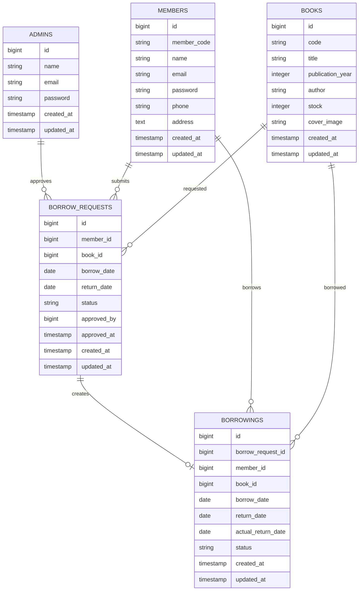

# Library - Aplikasi Peminjaman Buku

Aplikasi web sederhana untuk mengelola peminjaman buku perpustakaan. Project ini dibuat dengan Laravel dan memiliki dua role pengguna: **Admin** dan **Anggota**.

## Fitur Utama

- Login multiuser untuk admin dan anggota.
- CRUD master buku.
- CRUD anggota.
- Pengajuan peminjaman buku oleh anggota.
- Approve atau reject pengajuan oleh admin.
- Stok buku otomatis berkurang saat pengajuan disetujui.
- Status peminjaman dapat diubah menjadi dikembalikan.
- Stok buku otomatis bertambah saat buku dikembalikan.
- DataTables serverside untuk list data.
- API JSON untuk CRUD buku.

## Tech Stack

- PHP 8.3+
- Laravel
- Laravel Eloquent ORM
- Laravel Guard untuk multiauth
- SQLlite
- AdminLTE
- jQuery
- AJAX
- Yajra DataTables

## Instalasi Local

Clone repository:

```bash
git clone <repository-url>
cd library
```

Install dependency PHP:

```bash
composer install
```

Install dependency frontend:

```bash
npm install
```

Buat file environment:

```bash
cp .env.example .env
```

Generate application key:

```bash
php artisan key:generate
```

Siapkan database SQLite:

```bash
touch database/database.sqlite
```

Pastikan konfigurasi database di `.env` menggunakan SQLite:

```env
DB_CONNECTION=sqlite
```

Jalankan migration dan seeder:

```bash
php artisan migrate --seed
```

Buat storage link:

```bash
php artisan storage:link
```

Jalankan server Laravel:

```bash
php artisan serve --host=127.0.0.1 --port=3000
```

Jalankan Vite di terminal lain:

```bash
npm run dev
```

Aplikasi dapat dibuka di:

```text
http://127.0.0.1:3000
```

## Akun Demo

Semua akun demo menggunakan password:

```text
password
```

Admin:

```text
admin@example.com
petugas@example.com
```

Anggota:

```text
anggota@example.com
sari@example.com
bima@example.com
```

## Halaman Web

| URL                      | Keterangan                 |
| ------------------------ | -------------------------- |
| `/login`                 | Login admin atau anggota   |
| `/admin`                 | Dashboard admin            |
| `/admin/books`           | Manajemen buku             |
| `/admin/members`         | Manajemen anggota          |
| `/admin/borrow-requests` | Pengajuan peminjaman       |
| `/admin/borrowings`      | Data peminjaman            |
| `/member`                | Dashboard anggota          |
| `/member/borrow-request` | Form pengajuan peminjaman  |
| `/member/borrowings`     | Riwayat peminjaman anggota |

## ERD



## API Buku

Base URL:

```text
http://127.0.0.1:3000/api
```

Gunakan header berikut untuk request JSON di Postman:

```text
Accept: application/json
Content-Type: application/json
```

| Method    | Endpoint            | Keterangan                         |
| --------- | ------------------- | ---------------------------------- |
| GET       | `/api/books`        | Ambil semua buku                   |
| GET       | `/api/books/{code}` | Ambil detail buku berdasarkan kode |
| POST      | `/api/books`        | Tambah buku baru                   |
| PUT/PATCH | `/api/books/{code}` | Update buku berdasarkan kode       |
| DELETE    | `/api/books/{code}` | Hapus buku berdasarkan kode        |

Contoh body `POST /api/books`:

```json
{
    "code": "BK013",
    "title": "Clean Code",
    "publication_year": 2024,
    "author": "Robert C. Martin",
    "stock": 5
}
```

Contoh body `PUT /api/books/BK013`:

```json
{
    "title": "Clean Code Edisi Revisi",
    "publication_year": 2025,
    "author": "Robert C. Martin",
    "stock": 8
}
```

## Postman Collection

File export Postman dapat diletakkan di folder:

```text
docs/postman/
```

File collection yang tersedia:

```text
docs/postman/Library.postman_collection.json
```

Cara import di Postman:

1. Buka Postman.
2. Klik **Import**.
3. Pilih file `docs/postman/Library.postman_collection.json`.
4. Pastikan variable `base_url` mengarah ke URL local Laravel:

```text
http://127.0.0.1:3000
```

Jika server berjalan di port lain, sesuaikan nilai `base_url`.
